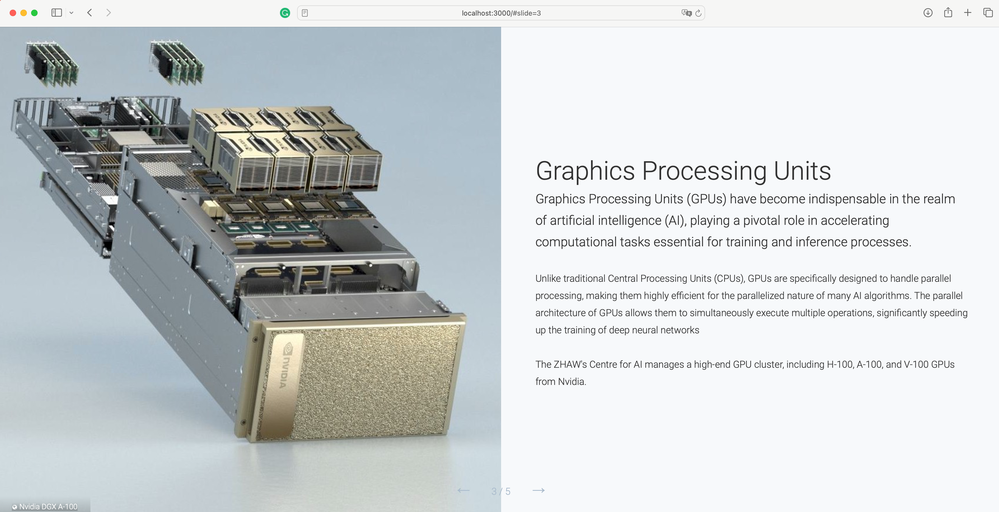

# ZHAW-Vitrinr

This is a very Webapp based on [Next.js](https://nextjs.org/) and [Tailwind CSS](https://tailwindcss.com/).
The webapp is used to explain various objects showcased inside the class cabinet at ZHAW's Center for AI.




## Gesture Recognition

It has an integrated gesture recognition running locally within the browser to switch between pages, allowing to switch pages manually even though the tablet is inside the glas cabinet.


## Run it locally

First, run the development server:

```bash
npm run dev
# or
yarn dev
# or
pnpm dev
# or
bun dev
```

Open [http://localhost:3000](http://localhost:3000) with your browser to see the result.

## Deploy on Vercel

The easiest way to deploy your Next.js app is to use the [Vercel Platform](https://vercel.com/new?utm_medium=default-template&filter=next.js&utm_source=create-next-app&utm_campaign=create-next-app-readme).

Check out our [Next.js deployment documentation](https://nextjs.org/docs/deployment) for more details.
